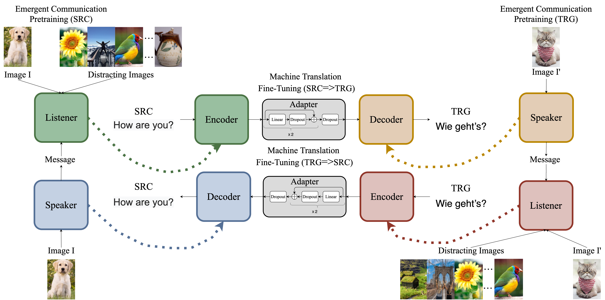

# ECNMT: Emergent Communication Pretraining for Few-Shot Machine Translation
This repository is the official PyTorch implementation of the following paper: 

Yaoyiran Li, Edoardo Maria Ponti, Ivan Vulić, and Anna Korhonen. 2020. *Emergent Communication Pretraining for Few-Shot Machine Translation*. In Proceedings of the 28th International Conference on Computational Linguistics (COLING 2020).

This method is a form of unsupervised knowledge transfer in the absence of linguistic data, where a model is first pre-trained on *artificial* languages emerging from referential games and then fine-tuned on few-shot downstream tasks like neural machine translation.



## Dependencies

- PyTorch 1.3.1
- Python 3.6

## Data
To download COCO image features and preprocessed EN-DE (DE-EN) data, please follow the [Translagent](https://github.com/facebookresearch/translagent) repo, where image features are located in "./coco_new/half_feats/" and EN-DE (DE-EN) data are in "./multi30k_reorg/task1/".

The preprocessed data for EN-CS (CS-EN), EN-RO (RO-EN) and EN-FR (FR-EN), and EC pertrained models for all four language pairs can be downloaded via a Google Drive [link](https://drive.google.com/drive/folders/1sMWfvfRf9uj-LJJTye7XCixsES1EPslr?usp=sharing.).
## Pretrained Models

### Emergent Communication Pretraining
----
| [EN](https://drive.google.com/file/d/1PiAdeUuSjjlgfLMkEmTdD2EtPuPwUgq4/view?usp=sharing) | [DE](https://drive.google.com/file/d/16_pOVlQhqHnjv_LuyaAzYCHhRiCKrCvP/view?usp=sharing) |
| [EN](https://drive.google.com/file/d/1z0JbwMxgB32CYXn99RbdhHreZpzeME-1/view?usp=sharing) | [CS](https://drive.google.com/file/d/1WfQzwItzMEHnd0jzwSPFx1K806TMLjku/view?usp=sharing) |
| [EN](https://drive.google.com/file/d/1dvGcmjIg5bSMUR89abv_zPQo4TmuwXHF/view?usp=sharing) | [RO](https://drive.google.com/file/d/12_OXbnBpIRzwrBq1PDGCy-SJi0FwLpfq/view?usp=sharing) |
| [EN](https://drive.google.com/file/d/1cbQCTL6e1U6ctmKf1kVlYy9192V48QjK/view?usp=sharing) | [FR](https://drive.google.com/file/d/1MSM4pyXEVHve3fTqnaB5kY-HkqccMQAm/view?usp=sharing) |
----

## Experiments

Step 1: run EC pretraining (otherwise go to Step 2 and use a pretrained model).
```bash
cd ./ECPRETRAIN
sh run_training.sh
 ```
                         
Step 2: run NMT fine-tuning (please modify the roots for training data, pretrained model and saved path before).
```bash
cd ./NMT
sh run_training.sh
```

Optional: run baseline

```bash
cd ./BASELINENMT
sh run_training.sh
 ```
   
## Citation

    @inproceedings{YL:2020,
      author    = {Yaoyiran Li and Edoardo Maria Ponti and Ivan Vulić and Anna Korhonen},
      title     = {Emergent Communication Pretraining for Few-Shot Machine Translation},
      year      = {2020},
      booktitle = {Proceedings of the 28th International Conference on Computational Linguistics},
    }
    
## Acknowledgements

Part of the code is based on https://github.com/facebookresearch/translagent. The original datasets for our experiments include [MS COCO](http://cocodataset.org/#home) for Emergent Communication pretraining, and [Multi30k Task 1](https://github.com/multi30k/dataset) and [Europarl](http://www.statmt.org/europarl/v7/) for NMT fine-tuning. Text preprcessing is based on [Moses](https://github.com/moses-smt/mosesdecoder "Moses") and [Subword-NMT](https://github.com/rsennrich/subword-nmt "Subword-NMT"). Please cite them accordingly.
